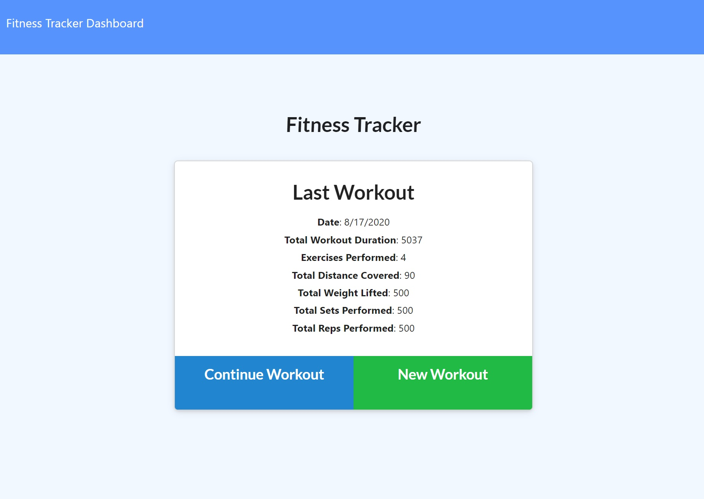

# Brad Pritchett's Fitness Tracker

This application allows users to record various exercises that they performed during a day's workout. 

## Demo
[View on Heroku](https://lit-journey-40402.herokuapp.com/?id=5f43d85761713c00170bc816)

## Requirements
Chatify requires users to have existing Spotify accounts to be able to post comments and view other's posts.

## Build
This application is built with:
[NodeJS](https://nodejs.org/en/)([Express](https://expressjs.com/)

## Authors
[Brad Prichett](https://github.com/bradpritchett)

## Contributing
Pull requests are welcome. For major changes, please open an issue first to discuss what you would like to change.

Please make sure to update tests as appropriate.

## License
[ISC](https://choosealicense.com/licenses/ISC/)
